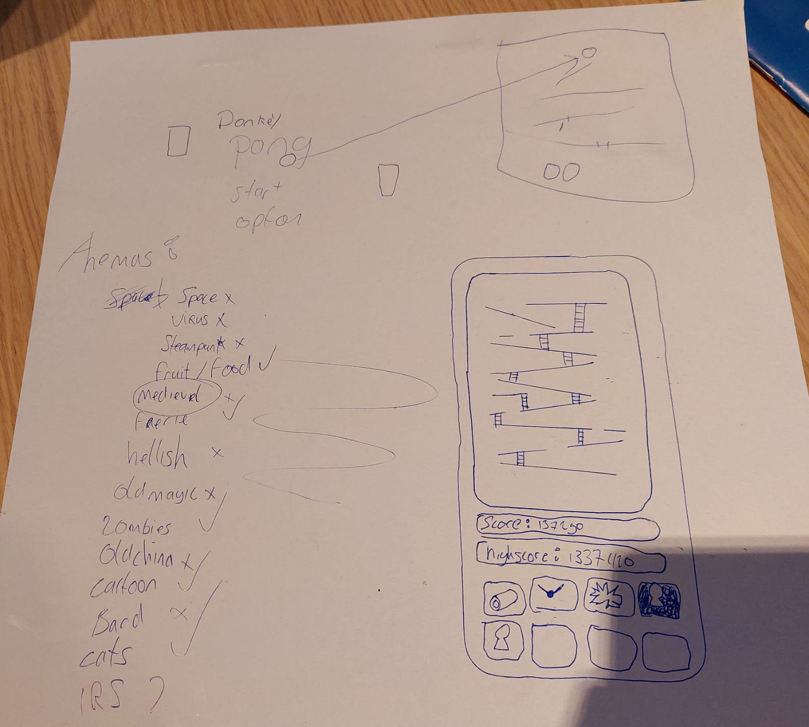

## Idee 1 - PacmanButBetter  

Het eerste idee, na korte brainstorm, is om een remake te makken van de klassieke arcade game 'PacMan', maar in plaats van de normale gameplay, is hij eigenlijk een belastingontduiker.  

Na jarenlang niet gepakt te worden, is de dag eindelijk daar dat hij (dronken) in zijn appartement gevonden wordt. Met een knuppel wordt hij KO geslagen. Als straf komt PacMan voor altijd in een onuitbreekbaar doolhof terecht. Dag in, dag uit doet hij hetzelfde, geterroriseerd door zijn herinneringen aan zijn vorige leven. Hij is uit op wraak.  

In plaats van de normale kersen, vindt hij na bepaalde een pepertje. Deze verorbert hij direct, hij groeit, stoom komt uit al zijn gaten (slechts mond). Met zijn nieuw verkregen kracht breekt hij uit de matrix. Hier gaat hij uit op wraak. Het spel verandert van een maze, naar een hack n' slash game.  

## Idee 2 - Pongkey Kong  

Zoals de naam zegt, is het een mengsel van 'Pong' en 'Donkey Kong'. Echter heeft het niks te maken met Pong, maar wel met Donkey Kong, dus de naam slaat in essentie nergens op.  
Tijdens het wachten ziet de speler in het startmenu een spelletje Pong live plaatsvinden, dus wordt de gebruiker in het ootje genomen, want zodra de speler in het startmenu op 'start' drukt, vliegt het balletje het scherm uit en verandert deze langzaam in Donkey Kong.  

Kong wordt al meerdere decennia lastig gevallen door Mario (of Marco ivm copyright. Dat zou betekenen: Marco's informele bijeenkomst ipv Mario Party), dus speelt de speler vanuit het perspectief van Kong. Met de gegeven abilities, die onderaan in het scherm duidelijk aangegeven zijn, is het de bedoeling dat Marco keihard gepompt wordt.  

Iedere keer dat hij sterft, op gruwelijke wijze, wordt het volgende level iets lastiger. Er komt meer onvoorspelbaarheid en snelheid, wat het dus steeds moeilijker maakt om hem neer te halen. Ook komen er na een bepaalde hoeveelheid levels afleidingen, die ervoor zorgen dat de speler het scherm slechter kan zien.  

Dit wordt een spel waar veel gebruik gemaakt kan worden van particles, velle kleuren, ruig beeldmateriaal.  
  

### Pongkey Kong - Thema  

Om het spel toegankelijk en leuk te maken voor iedereen, is er gekozen om een thema te gebruiken die vooral werkt met velle, gesatureerde kleuren en particles.  

### Pongkey Kong - Moeilijkheidsgraad  

Verschillende ideeën zijn bedacht over de moeilijkheidsgraad van het spel, hieronder enkele ideeën:
- Resource management, er zijn maar een bepaald aantal objecten die de speler kan gebruiken om de tegenstander neer te halen, anders is het level verloren.
- Enemy increase, verschillende enemies met andere class properties door de levels heen. Vliegende enemies/lopende enemies.  

### Pongkey Kong - Wapenmechanismen  

- Een aardbei die de speler naar beneden kan laten rollen. Deze doodt 1 enemy op impact, verdwijnt vervolgens.  
- Een slingshot die een druif in een rechte lijn naar beneden schiet, ook deze doodt 1 enemy op impact.
- Een banaan die in een boomerang vorm geworpen wordt (bananarang), en elke enemy doodt die hij raakt. Deze heeft een redelijk hoge cooldown.
- Een granaatappel die geworpen kan worden, en vervolgens explodeert na een bepaalde tijd. Vervolgens doodt dit alle enemies binnen een bepaalde radius.