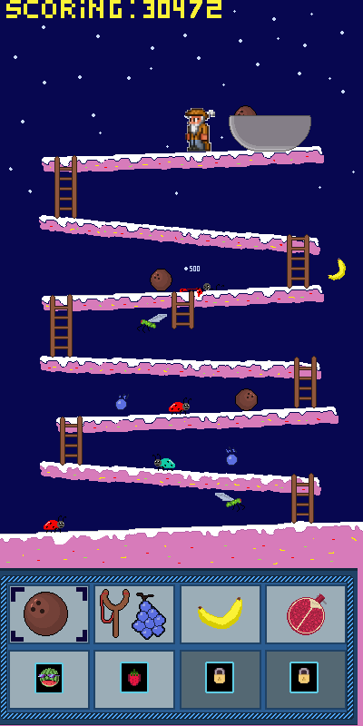

## Fruitige Frank ©

Fruitige Frank's fruit voorraad wordt aangevallen door fruit lustige insecten, daarom gebruikt hij alles in zijn arsenaal om zijn fruit te verdedigen.  

Dit wordt een spel waar veel gebruik gemaakt kan worden van particles, velle kleuren, ruig beeldmateriaal.  

Hieronder staan wat ruwe schetsen van hoe het er in-game uitziet.
  

Hieronder het concept, maar dan netter uitgewerkt (portrait):  

### Doelgroep  

[Cijfers](https://www.nji.nl/cijfers/gamen)  
Met bovenstaande link hebben wij onderzocht op welke doelgroep wij ons moeten focussen. In 2021 zegt 13 procent van de middelbare scholieren en 14 procent van de basisschool leerlingen minstens 24 uur per week te gamen. Deze doelgroep is perfect voor ons spel.  
[Mobile vs console](http://www.multiscope.nl/persberichten/nederlanders-gamen-dagelijks-half-miljard-minuten.html)  
Met de link hierboven is het duidelijk dat mobile gaming elke andere soort van gaming verslaat, dus willen we ons focussen op het goed speelbaar maken op telefoon. Het grootste gedeelte van de mobile gamers speelt Candy Crush, een spel dat vooral gefocust is op velle en gesatureerde kleuren.
### Fruitige Frank - Thema  

Om het spel toegankelijk en leuk te maken voor iedereen, is er gekozen om een thema te gebruiken die vooral werkt met velle, gesatureerde kleuren en veel particles.  

### Fruitige Frank - Moeilijkheidsgraad  

Verschillende ideeën zijn bedacht over de moeilijkheidsgraad van het spel, hieronder enkele ideeën:
- Resource management, er zijn maar een bepaald aantal objecten die de speler kan gebruiken om de tegenstander neer te halen, anders is het level verloren.
- Enemy increase, verschillende enemies met andere class properties door de levels heen. Vliegende enemies/lopende enemies.  

###  Fruitige Frank - Wapenmechanismen  

- Een aardbei die de speler naar beneden kan laten rollen. Deze doodt 1 enemy op impact, verdwijnt vervolgens.  
- Een slingshot die een druif in een rechte lijn naar beneden schiet, ook deze doodt 1 enemy op impact.
- Een banaan die in een boomerang vorm geworpen wordt (bananarang), en elke enemy doodt die hij raakt. Deze heeft een redelijk hoge cooldown.
- Een granaatappel die geworpen kan worden, en vervolgens explodeert na een bepaalde tijd. Vervolgens doodt dit alle enemies binnen een bepaalde radius.

### Fruitige Frank - Levels  
- Zodra alle enemies in een level verslagen zijn, begint het volgende level.
- Aan het begin van een level zijn alle abilities bruikbaar.
- Als de tijd op is, stopt het level en begint de speler opnieuw.
- In een nieuw level is er de mogelijkheid om nieuwe abilities te unlocken, die de speler helpen met de enemies te verslaan.  
- Er is een endless mode, die gaat door totdat de speler dood is. De enemies worden steeds sneller en meer divers.
